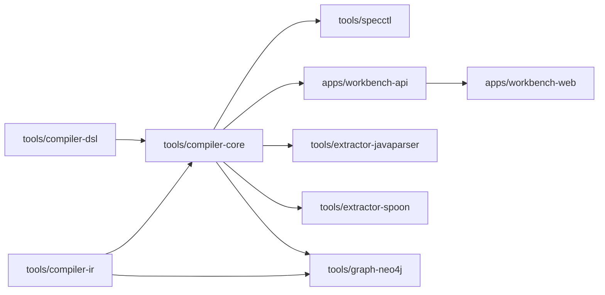
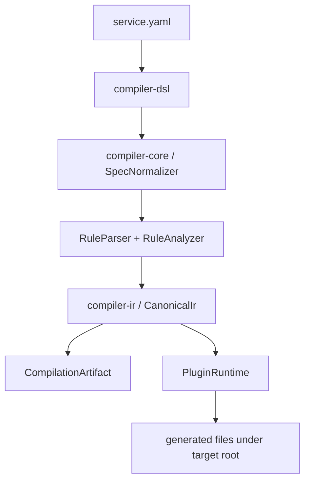
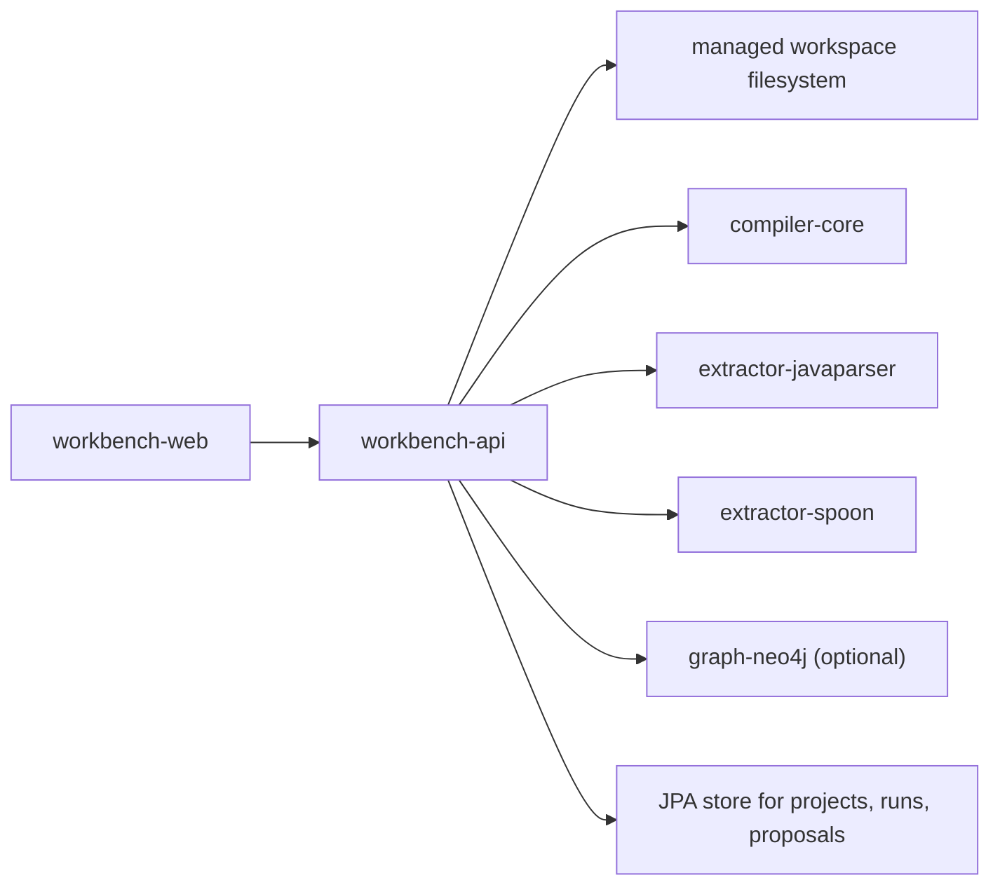

# Kanon

Kanon is a deterministic spec-compiler and local workbench for Java service analysis. The repo is organized around a
strict separation between authored DSL, canonical IR, orchestration, extraction backends, graph projection, and
operator-facing tooling.

This README is the repo map. Each tool and app has its own module README with the detailed architecture, logic diagrams,
and operational notes for that slice.

## What The Repo Contains

- A YAML DSL for service specs and migration plans
- A canonical IR with stable IDs and parsed rule ASTs
- A compiler core that normalizes DSL into IR and runs deterministic plugins
- Two Java extraction backends with mergeable evidence
- A versioned Neo4j projection adapter
- A CLI for validation, generation, extraction, and migration
- A Spring Boot workbench API
- A React/Vite workbench UI

## Architectural Boundaries

- `compiler-dsl` owns input documents and parsing.
- `compiler-ir` owns canonical records, rule ASTs, and stable IDs.
- `compiler-core` owns normalization, diagnostics, orchestration, analysis, and deterministic generation.
- Extractors own source analysis only.
- `graph-neo4j` owns graph projection only.
- `specctl` and the workbench apps are transports around the tool modules.

## Module Map

| Module                       | Role                                               | Docs                                                                         |
|------------------------------|----------------------------------------------------|------------------------------------------------------------------------------|
| `tools/compiler-dsl`         | YAML DTOs and parsing                              | [tools/compiler-dsl/README.md](tools/compiler-dsl/README.md)                 |
| `tools/compiler-ir`          | Canonical IR, rule AST, stable IDs                 | [tools/compiler-ir/README.md](tools/compiler-ir/README.md)                   |
| `tools/compiler-core`        | Normalization, diagnostics, orchestration, plugins | [tools/compiler-core/README.md](tools/compiler-core/README.md)               |
| `tools/extractor-javaparser` | Semantic-first Java extraction backend             | [tools/extractor-javaparser/README.md](tools/extractor-javaparser/README.md) |
| `tools/extractor-spoon`      | Structure-first Java extraction backend            | [tools/extractor-spoon/README.md](tools/extractor-spoon/README.md)           |
| `tools/graph-neo4j`          | Versioned Neo4j projection                         | [tools/graph-neo4j/README.md](tools/graph-neo4j/README.md)                   |
| `tools/specctl`              | CLI entry point                                    | [tools/specctl/README.md](tools/specctl/README.md)                           |
| `apps/workbench-api`         | Spring Boot control-plane backend                  | [apps/workbench-api/README.md](apps/workbench-api/README.md)                 |
| `apps/workbench-web`         | React/Vite operator console                        | [apps/workbench-web/README.md](apps/workbench-web/README.md)                 |

## Module Dependency Diagram



## Compiler Flow



## Workbench Flow



## Repository Layout

```text
schemas/                     JSON schemas and rule grammar
tools/compiler-dsl/          YAML DTOs and parsing
tools/compiler-ir/           Canonical IR, rule AST, stable IDs
tools/compiler-core/         Normalization, diagnostics, orchestration, plugins
tools/specctl/               CLI entry point
tools/extractor-javaparser/  JavaParser extraction backend
tools/extractor-spoon/       Spoon extraction backend
tools/graph-neo4j/           Neo4j projection adapter
apps/workbench-api/          Spring Boot workbench backend
apps/workbench-web/          React/Vite workbench frontend
docker/                      Local workbench Docker stack
test-fixtures/basic-service/ Fixture project used by tests and examples
```

## Local Development

### Prerequisites

- JDK 21
- Node.js 22+ and npm 11+
- Docker Desktop if you want the local container stack

### Core Verification

```powershell
set JAVA_HOME=C:\path\to\jdk-21
.\gradlew.bat test
.\gradlew.bat :apps:workbench-api:compileJava
npm install --prefix apps/workbench-web
npm run build --prefix apps/workbench-web
```

### CLI Examples

```powershell
.\gradlew.bat :tools:specctl:run --args="validate --specs D:/Desktop/mdl/test-fixtures/basic-service/specs/service.yaml"
.\gradlew.bat :tools:specctl:run --args="generate --specs D:/Desktop/mdl/test-fixtures/basic-service/specs/service.yaml --target D:/code/my-service"
.\gradlew.bat :tools:specctl:run --args="extract --project D:/Desktop/mdl/test-fixtures/basic-service/src/main/java --out D:/Desktop/mdl/build/extraction.json"
```

### Workbench Without Docker

Start the API:

```powershell
set JAVA_HOME=C:\path\to\jdk-21
.\gradlew.bat :apps:workbench-api:bootRun
```

Start the frontend:

```powershell
npm install --prefix apps/workbench-web
npm run dev --prefix apps/workbench-web
```

The UI runs on `http://localhost:4173` and proxies `/api` to `http://localhost:8080`.

## Docker Stack

The root Docker stack is for Kanon itself, not for generated-project runtime infrastructure.

Base stack:

```powershell
docker compose -f docker/compose.yml up --build
```

Base stack plus local Ollama:

```powershell
$env:KANON_AI_PROVIDER="ollama"
docker compose -f docker/compose.yml --profile ai-local up --build
```

The base Compose stack includes:

- `web` on `http://localhost:3000`
- `api` on `http://localhost:8080`
- `postgres` on `localhost:5432`
- `neo4j` on `http://localhost:7474` and `bolt://localhost:7687`

Optional profile:

- `ai-local` adds Ollama on `http://localhost:11434`

When the API runs in Docker, imported source paths must also be visible inside the `api` container. The default
compose file bind-mounts your home directory read-only so imports like `/Users/<name>/...` continue to work from the
UI. The API also exposes the current import roots in `/api/settings` so the UI can show which directories are
reachable.

Generated or managed service runtime concerns should live with the generated or managed project, not in this root
compose file.

## Determinism Rules

- Stable canonical paths are derived from normalized names.
- Stable IDs are derived from normalized structure and SHA-256 hashes.
- Defaulting happens before stable IDs are computed.
- Plugin output is generated twice and compared for deterministic equality.
- Plugins own explicit output roots and those roots are cleaned before materialization.
- Generated output is restricted to `src/generated/**`.

## Fixture Project

`test-fixtures/basic-service` is the repo-local fixture used by tests and by the examples in this repo. It is not a
reference product or a seed project. It exists to keep tests and docs self-contained.

## Where To Go Next

- Start with [tools/compiler-core/README.md](tools/compiler-core/README.md) if you need the compiler execution model.
- Start with [apps/workbench-api/README.md](apps/workbench-api/README.md) if you need the operator workflow and runtime
  picture.
- Start with [tools/specctl/README.md](tools/specctl/README.md) if you want command-line usage.
