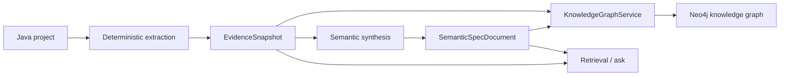

# Kanon

Kanon now centers on two first-class layers:

- a deterministic `EvidenceSnapshot`
- an AI- or synthesis-derived `SemanticSpecDocument`

The deterministic layer captures code, resources, contracts, migrations, jobs, integrations, docs, provenance, and confidence. The semantic layer turns that evidence into a human-editable spec with explicit citations. Neo4j stores both layers together as a knowledge graph.

## Project Map

| Project | Role |
| --- | --- |
| `tools/codebase-model` | Shared extraction/evidence types, confidence, manifests, snapshots |
| `tools/codebase-extractor` | Deterministic extraction and evidence adapters |
| `tools/spec-model` | Shared semantic spec types plus legacy compatibility models |
| `tools/spec-compiler` | Semantic synthesis, validation, retrieval context, and retained compatibility code |
| `tools/graph-neo4j` | Dual evidence + semantic Neo4j projection |
| `apps/specctl` | CLI for `extract`, `validate`, `synthesize`, `approve`, `graph rebuild`, `ask` |
| `apps/workbench-api` | Backend orchestration for evidence/spec/graph/ask workflows |
| `apps/workbench-web` | Browser UI for evidence, semantic spec, graph, and ask stages |

## High-Level Flow



## What Changed

- Framework-specific heuristics are no longer the primary semantic path.
- Deterministic adapters still exist, but only as evidence producers.
- The workbench now revolves around `Evidence`, `Semantic Spec`, `Graph`, and `Ask`.
- Neo4j now stores semantic nodes, evidence nodes, and `DERIVED_FROM` lineage links.
- Legacy canonical/generation code remains only as compatibility ballast while the new architecture settles.

## Development

```bash
./gradlew test
npm test --prefix apps/workbench-web
npm run build --prefix apps/workbench-web
```

## CLI Examples

```bash
./gradlew :apps:specctl:run --args="extract --project /path/to/service --out-dir /tmp/kanon-runs"
./gradlew :apps:specctl:run --args="synthesize --project /path/to/service --out /tmp/semantic-spec.yaml --run-dir /tmp/kanon-runs"
./gradlew :apps:specctl:run --args="validate --spec /tmp/semantic-spec.yaml --manifest /tmp/kanon-runs/manual-synthesis-extraction-manifest.json"
```

## Local Workbench

```bash
./gradlew :apps:workbench-api:bootRun
npm run dev --prefix apps/workbench-web
```
