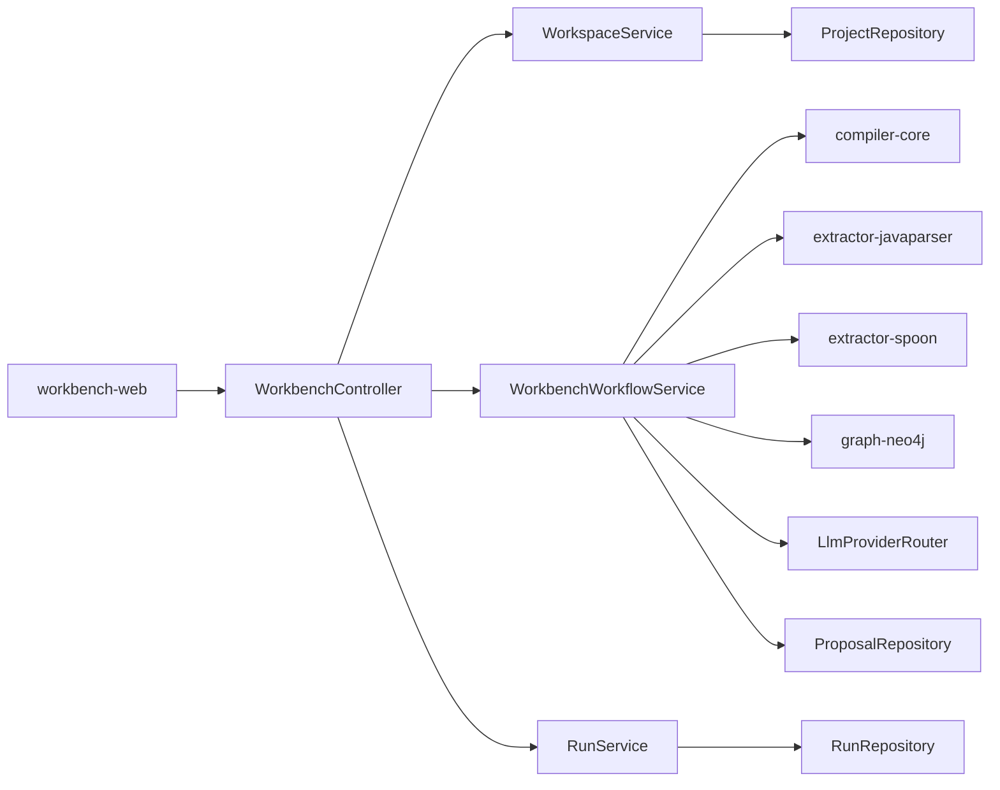
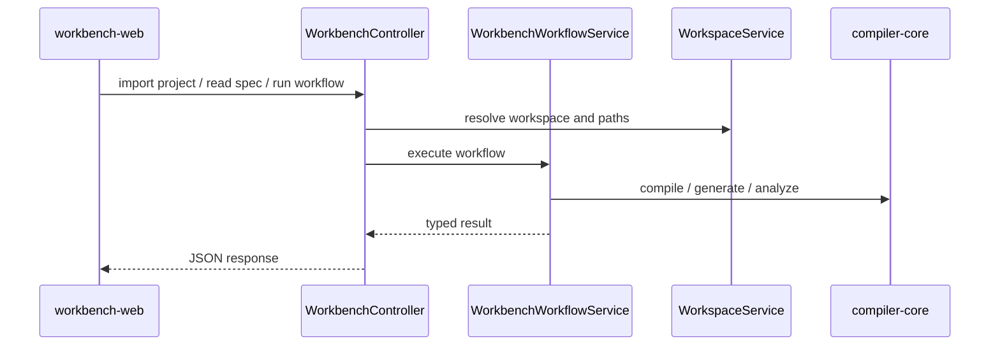

# workbench-api

`workbench-api` is the local control-plane backend for Kanon. It exposes project import, spec management, extraction, proposals, generation, drift, contract diff, and graph views over HTTP.

## Responsibility

- Provide the HTTP API used by the workbench UI.
- Manage workspace metadata and workspace-local filesystem state.
- Orchestrate compiler, extraction, drift, proposal, and graph flows.
- Persist projects, runs, and proposals with JPA.
- Route proposal generation through heuristic, hosted, or Ollama-backed providers.

## Runtime Topology



## Core Services

- `WorkbenchController` defines the `/api/**` surface.
- `WorkspaceService` imports source projects and lays out managed workspace directories.
- `WorkbenchWorkflowService` coordinates extraction, draft spec creation, validation, proposals, generation, drift, contracts, and lineage views.
- `RunService` tracks run state and metadata.
- `LlmProviderRouter` selects between heuristic, hosted, and Ollama providers.

## Workspace Layout

When a project is imported, the API creates a managed workspace under `KANON_WORKSPACE_ROOT` with:

- `specs/approved`
- `specs/drafts`
- `proposals`
- `runs`
- `contracts/baseline`
- `generated`

## API Shape

- `/api/projects`
- `/api/projects/import`
- `/api/projects/{projectId}/spec`
- `/api/projects/{projectId}/extract`
- `/api/projects/{projectId}/draft-spec`
- `/api/projects/{projectId}/proposals/spec`
- `/api/projects/{projectId}/proposals/story`
- `/api/projects/{projectId}/generate`
- `/api/projects/{projectId}/drift`
- `/api/projects/{projectId}/contracts/diff`
- `/api/projects/{projectId}/graph/lineage`
- `/api/settings`

## Request Flow



## Configuration

- `KANON_WORKSPACE_ROOT`
- `KANON_DATASOURCE_URL`
- `KANON_DATASOURCE_USERNAME`
- `KANON_DATASOURCE_PASSWORD`
- `KANON_NEO4J_URI`
- `KANON_NEO4J_USERNAME`
- `KANON_NEO4J_PASSWORD`
- `KANON_AI_PROVIDER`
- `KANON_AI_HOSTED_BASE_URL`
- `KANON_AI_HOSTED_API_KEY`
- `KANON_AI_HOSTED_MODEL`
- `KANON_AI_OLLAMA_BASE_URL`
- `KANON_AI_OLLAMA_MODEL`

## Local Development

```powershell
.\gradlew.bat :apps:workbench-api:bootRun
.\gradlew.bat :apps:workbench-api:compileJava
```

## Related Docs

- [Root README](../../README.md)
- [workbench-web](../workbench-web/README.md)
- [compiler-core](../../tools/compiler-core/README.md)
