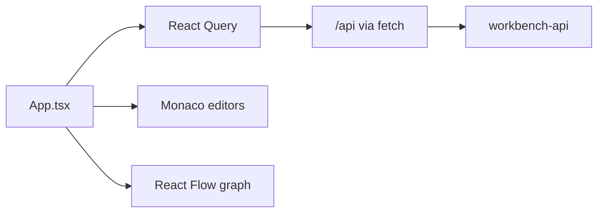
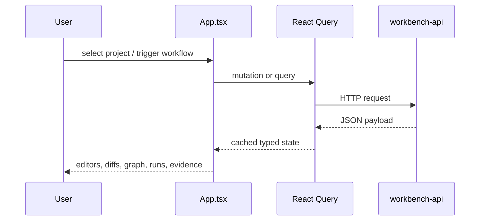

# workbench-web

`workbench-web` is the operator-facing UI for Kanon. It is a React + Vite single-page control plane that drives the local workbench API.

## Responsibility

- Show imported projects and runtime configuration.
- Provide spec editing, validation, and proposal review.
- Trigger extraction, draft rebuild, generation, and drift workflows.
- Visualize lineage graphs, contract deltas, run history, and evidence.

## Frontend Topology



## UI Structure

- Project import and project selection
- Runtime status panel
- Workflow controls for extract, draft, validate, save, generate, and drift
- Spec editor and diff review
- Proposal queue for spec and story proposals
- Lineage graph and evidence views
- Drift, contract, and run-history panels

## Main Files

- `src/App.tsx` contains the page shell and feature orchestration.
- `src/api.ts` contains the thin fetch wrapper.
- `src/types.ts` defines the backend contract used by the UI.
- `vite.config.ts` sets the local dev server and `/api` proxy to `http://localhost:8080`.

## Interaction Flow



## Local Development

```powershell
npm install --prefix apps/workbench-web
npm run dev --prefix apps/workbench-web
npm run build --prefix apps/workbench-web
```

The dev server runs on `http://localhost:4173` and proxies `/api` requests to the workbench API on `http://localhost:8080`.

## Design Notes

- The app is intentionally thin on client-side domain logic. Most semantics stay in the API and compiler modules.
- React Query is the state boundary for server data.
- The current UI is centered in a single `App.tsx` shell rather than a deep route tree, which makes cross-panel workflow coordination explicit.

## Related Docs

- [Root README](../../README.md)
- [workbench-api](../workbench-api/README.md)
