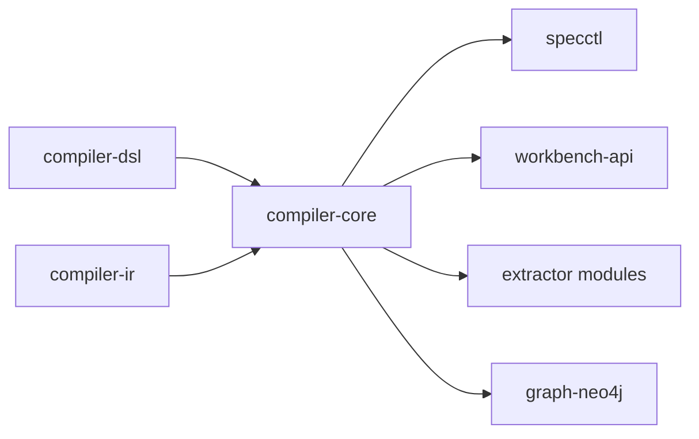
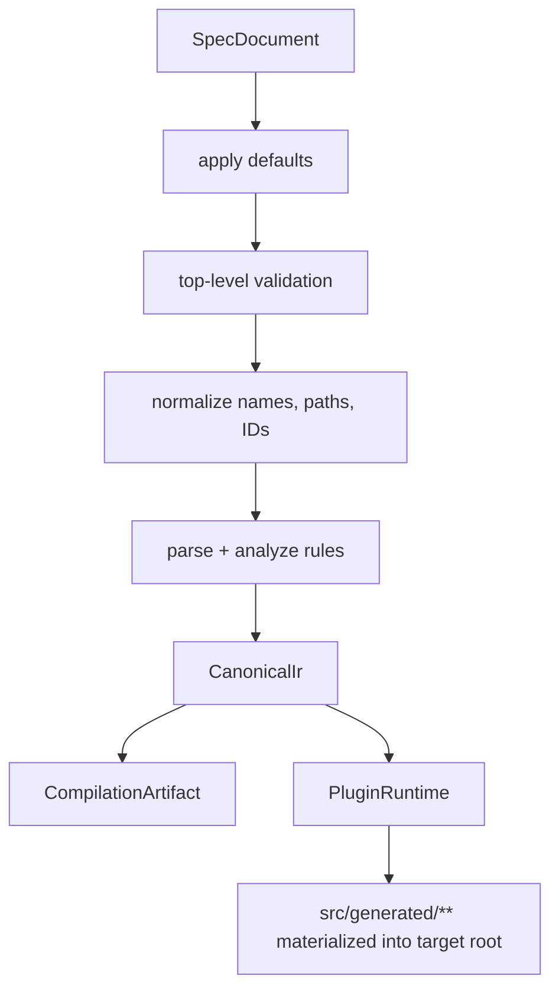
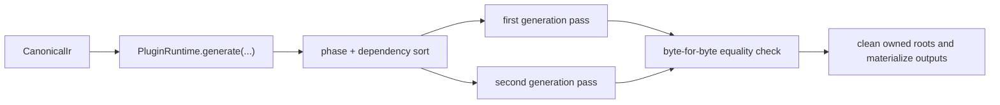

# compiler-core

`compiler-core` is the orchestration layer of Kanon. It converts DSL documents into canonical IR, validates semantics, merges extraction evidence, computes drift and contract deltas, applies migrations, and runs deterministic generation plugins.

## Responsibility

- Expose the `SpecCompiler` facade for compile and generate operations.
- Normalize `SpecDocument` into `CanonicalIr`.
- Parse and analyze rule expressions.
- Provide deterministic plugin execution and materialization.
- Define extraction contracts and merge logic.
- Build draft specs from extraction evidence.
- Plan and apply deterministic DSL migrations.
- Compute contract diffs and drift reports.

## Does Not Own

- Raw YAML DTOs and YAML parsing
- Canonical record definitions and stable IDs
- Concrete extractor backends
- Graph database integration
- CLI or HTTP transport

## Dependency Position

## Compile and Generate Flow

## Key Entry Points

- `SpecCompiler`
- `SpecNormalizer`
- `PluginRuntime`
- `BuiltinPlugins`
- `DraftSpecBuilder`
- `MigrationService`
- `ContractDiffService`
- `DriftAnalyzer`
- `ExtractionMerger`

## Plugin Runtime

The plugin runtime enforces two important invariants:

- Plugins are ordered deterministically.
- Plugin output must be identical across repeated runs for the same IR.

## Built-In Generation Areas

- bootstrap
- domain
- runtime
- API
- contracts
- persistence
- messaging
- security
- observability

Those areas are selected through `BuiltinPlugins.forCapabilities(...)`, using the project capability set.

## Extraction and Analysis Support

- `ExtractionRequest`, `ExtractionResult`, and `ExtractorBackend` define the shared extraction contract.
- `ExtractionMerger` combines JavaParser and Spoon outputs into one evidence set.
- `DraftSpecBuilder` turns extracted facts into a draft DSL document for workspace workflows.
- `DriftAnalyzer` compares extracted code facts with approved IR and flags unsupported handwritten or missing spec-owned elements.

## Migration Support

`MigrationService` currently supports deterministic, forward-only DSL transforms for:

- field renames
- aggregate renames
- command renames
- event renames
- rule expression rewrites

## Development Notes

- Add parser-facing fields in `compiler-dsl` first, then normalize them here into `compiler-ir`.
- New plugin families should declare owned output roots explicitly so cleanup stays deterministic.
- Keep transport logic out of this module. CLI and HTTP layers should depend on it, not the other way around.

## Verification

- `.\gradlew.bat :tools:compiler-core:test`

## Related Docs

- [Root README](../../README.md)
- [compiler-dsl](../compiler-dsl/README.md)
- [compiler-ir](../compiler-ir/README.md)
- [specctl](../specctl/README.md)
- [workbench-api](../../apps/workbench-api/README.md)
