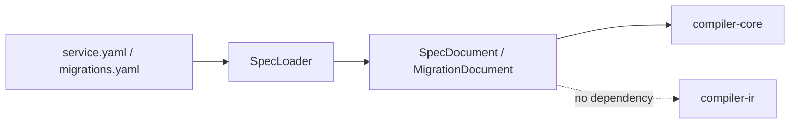
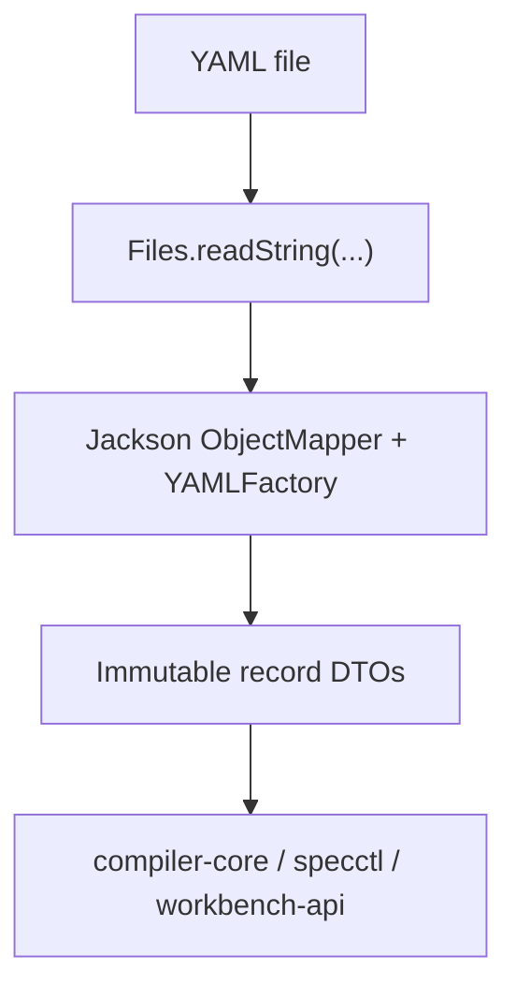

# compiler-dsl

`compiler-dsl` owns the raw YAML-facing document model for Kanon. It is the only module in the toolchain that knows how `service.yaml` and `migrations.yaml` are shaped on disk.

## Responsibility

- Parse YAML into immutable DTOs.
- Preserve the input-oriented structure of the spec and migration documents.
- Stay independent from canonical modeling and orchestration concerns.

## Does Not Own

- Stable IDs
- Canonical paths or normalized names
- Rule parsing or type checking
- Plugin execution
- Code generation

## Public Surface

- `SpecLoader`
- `SpecDocument`
- `MigrationDocument`

## Module Position



## Input Logic



## Key Decisions

- DTOs mirror the source document closely. That keeps parsing simple and makes migrations operate on the same shape that users author.
- Unknown YAML fields are ignored. This keeps the loader tolerant while normalization and diagnostics decide what is valid.
- Collection fields are copied into immutable lists/maps in the record constructors. Callers can treat the loaded documents as value objects.

## Main Types

- `SpecDocument` models service metadata, generation targets, bounded contexts, aggregates, commands, events, rules, security, observability, messaging, and distributed-model topology.
- `MigrationDocument` models deterministic rename and rule-rewrite operations.
- `SpecLoader` centralizes YAML parsing and Jackson configuration.

## Typical Use

```java
SpecLoader loader = new SpecLoader();
SpecDocument spec = loader.loadSpec(Path.of("specs/service.yaml"));
MigrationDocument migrations = loader.loadMigrations(Path.of("specs/migrations.yaml"));
```

## Development Notes

- If a new YAML section is introduced, add it here first.
- Keep this module free of normalization rules. Defaults and validation belong in `compiler-core`.
- If a field exists only to support canonical processing, it still belongs here only if it is authored in YAML.

## Verification

- `.\gradlew.bat :tools:compiler-dsl:test`

## Related Docs

- [Root README](../../README.md)
- [compiler-ir](../compiler-ir/README.md)
- [compiler-core](../compiler-core/README.md)
