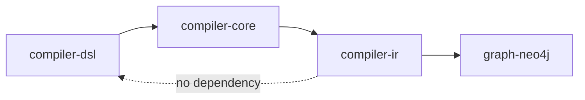
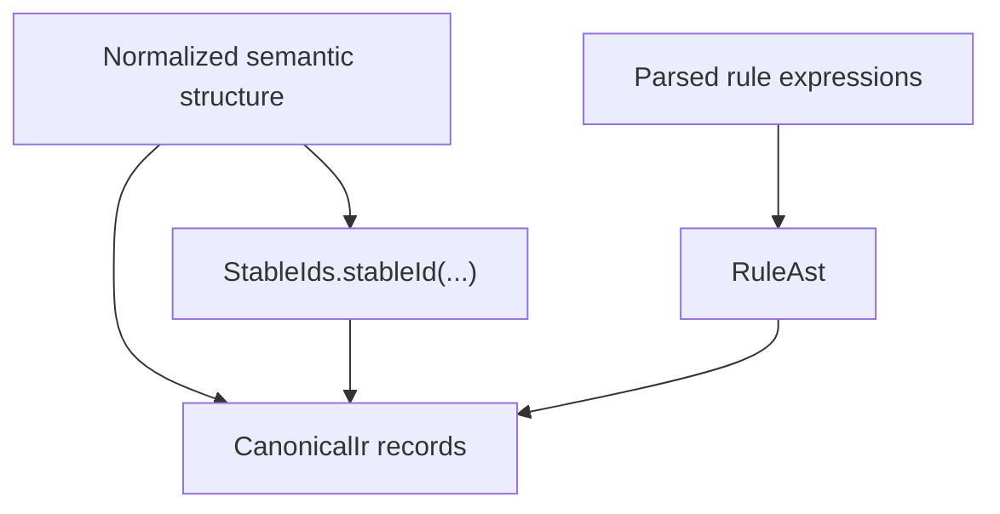

# compiler-ir

`compiler-ir` owns Kanon's canonical model. It is the stable representation that downstream orchestration, graph projection, and generation operate on after the YAML input has been normalized.

## Responsibility

- Define the canonical IR records used across the toolchain.
- Define the rule expression AST used after parsing.
- Generate deterministic stable IDs from normalized structure.

## Does Not Own

- YAML parsing
- Defaulting or validation rules
- Rule tokenization or type analysis
- Plugin execution
- Filesystem or runtime orchestration

## Module Position

## Canonicalization Logic

## Main Types

- `CanonicalIr`
- `RuleAst`
- `StableIds`

## Why This Module Exists

- The DSL should reflect author intent and author ergonomics.
- The IR should reflect deterministic compiler semantics.
- Keeping them separate makes it possible to evolve parsing, normalization, and generation independently.

## Determinism Guarantees

- Stable IDs are SHA-256 based.
- IDs are derived from normalized names, normalized parent scope, and a stable JSON hash of the normalized structure.
- No timestamps, randomness, or environment-derived values participate in the ID generation path.

## Canonical Model Shape

`CanonicalIr` includes:

- service metadata and generator lock
- generation, extraction, performance, security, observability, and messaging settings
- bounded contexts, aggregates, entities, commands, rules, events, hooks, and distributed-model topology
- an evidence sidecar for extracted provenance and conflicts

## Development Notes

- Add new canonical concepts here only when they are needed by multiple downstream consumers.
- Keep this module pure. Avoid filesystem, database, HTTP, and parser dependencies.
- If a concept exists only in the authored YAML shape, it belongs in `compiler-dsl`, not here.

## Verification

- `.\gradlew.bat :tools:compiler-ir:test`

## Related Docs

- [Root README](../../README.md)
- [compiler-dsl](../compiler-dsl/README.md)
- [compiler-core](../compiler-core/README.md)
