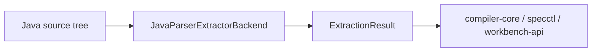
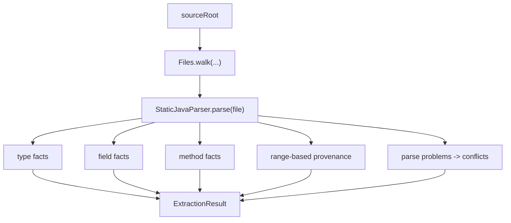

# extractor-javaparser

`extractor-javaparser` is the semantic-first Java extraction backend. It walks Java source files with JavaParser and emits normalized facts, provenance anchors, conflicts, and a confidence score.

## Responsibility

- Parse Java source files with JavaParser.
- Produce `ExtractionResult` facts for types, fields, and methods.
- Emit provenance ranges tied to source files and symbols.
- Report parse failures as extraction conflicts instead of crashing the workflow.

## Module Position

## Extraction Logic

## Output Characteristics

- Emits `type`, `field`, and `method` facts.
- Includes parameter details for methods.
- Uses JavaParser ranges for provenance anchors.
- Computes a confidence score based on parsed files versus conflicts.

## Trade-Offs

- Better semantic detail than the Spoon backend for straightforward source trees.
- More sensitive to parse issues and symbol-resolution gaps.
- Works best when the Java source is syntactically coherent.

## Development Notes

- This module should stay a backend implementation only. Shared extraction contracts belong in `compiler-core`.
- If a new fact shape is introduced, keep the path conventions aligned with the Spoon backend so merge behavior stays predictable.

## Verification

- `.\gradlew.bat :tools:extractor-javaparser:test`

## Related Docs

- [Root README](../../README.md)
- [compiler-core](../compiler-core/README.md)
- [extractor-spoon](../extractor-spoon/README.md)
