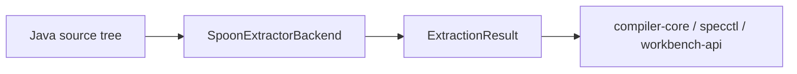
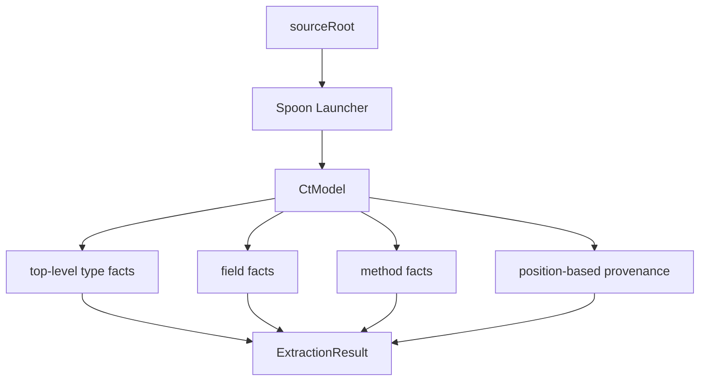

# extractor-spoon

`extractor-spoon` is the structure-first Java extraction backend. It builds a Spoon model in no-classpath mode and emits a second view of the same source tree so Kanon can merge evidence from two independent extraction strategies.

## Responsibility

- Build a structural Java model with Spoon.
- Emit `type`, `field`, and `method` facts with provenance anchors.
- Mark extracted facts as `structureOnly` where appropriate.
- Provide a second extraction signal for conflict detection and confidence blending.

## Module Position

## Extraction Logic

## Output Characteristics

- Emits the same core fact kinds as the JavaParser backend.
- Sets `structureOnly=true` on structural facts so callers can distinguish the signal source.
- Uses Spoon source positions for provenance.
- Runs in no-classpath mode to stay tolerant of incomplete compile setups.

## Why It Exists Alongside JavaParser

- JavaParser and Spoon fail differently.
- JavaParser tends to be stronger on direct AST parsing with symbol-oriented detail.
- Spoon gives a resilient structural view that is useful when classpath resolution is incomplete.
- `compiler-core` merges both outputs and records backend mismatches as conflicts rather than silently choosing one view.

## Development Notes

- Keep fact path conventions aligned with `extractor-javaparser`.
- This backend is intentionally narrow: it emits structural evidence, not semantic compiler decisions.

## Verification

- `.\gradlew.bat :tools:extractor-spoon:test`

## Related Docs

- [Root README](../../README.md)
- [compiler-core](../compiler-core/README.md)
- [extractor-javaparser](../extractor-javaparser/README.md)
