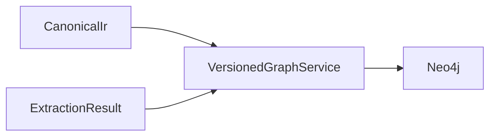
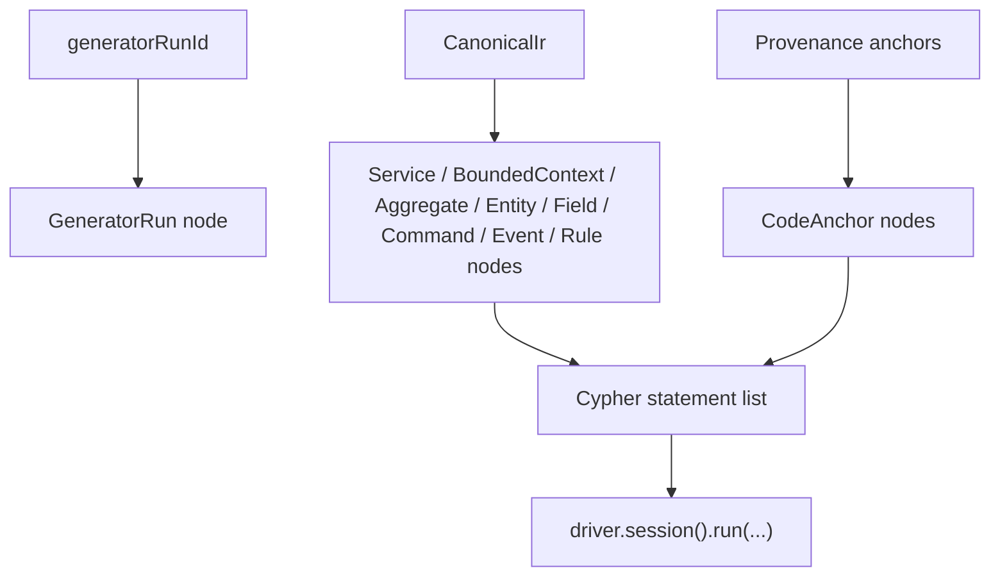

# graph-neo4j

`graph-neo4j` projects canonical IR and extraction provenance into a versioned Neo4j graph. It does not perform compilation or extraction itself; it translates existing Kanon artifacts into graph statements and persistence operations.

## Responsibility

- Define Neo4j schema constraints for versioned nodes.
- Translate IR and provenance into Cypher statements.
- Ingest versioned graph snapshots keyed by generator run ID.
- Produce a diff query for comparing graph versions.

## Module Position

## Projection Logic

## Versioning Model

- Every domain node is keyed by `(node_id, version)`.
- `version` is the generator run identifier passed in by the caller.
- Graph diffs compare snapshots by `node_id` across two versions rather than mutating nodes in place.

## Public Surface

- `schemaStatements()`
- `ingestStatements(...)`
- `ingest(...)`
- `diffQuery(...)`

## Development Notes

- This module should stay projection-only. Graph queries and ingestion belong here; canonical modeling does not.
- Keep the graph schema aligned with canonical node categories from `compiler-ir`.

## Verification

- `.\gradlew.bat :tools:graph-neo4j:test`

## Related Docs

- [Root README](../../README.md)
- [compiler-ir](../compiler-ir/README.md)
- [compiler-core](../compiler-core/README.md)
- [workbench-api](../../apps/workbench-api/README.md)
