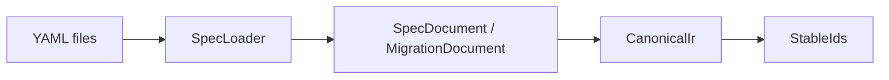

# spec-model

`spec-model` is the shared language for the spec side of Kanon.

It defines what a spec is, what a migration is, what canonical structure looks like, and how rule expressions are
represented after parsing.

## What Comes In And What Goes Out

- In:
    - YAML spec files
    - YAML migration files
    - rule text
- Out:
    - `SpecDocument`
    - `MigrationDocument`
    - `CanonicalIr`
    - `RuleAst`
    - stable IDs



## What This Project Does

- defines YAML-facing document records
- defines canonical IR records
- defines rule AST records
- defines stable ID helpers
- loads YAML from disk

## What This Project Does Not Do

- normalize specs
- analyze rule meaning
- generate files
- extract code from Java projects
- talk to Neo4j

## Dependencies

- Depends on:
    - Jackson
- Used by:
    - `tools/spec-compiler`
    - `tools/graph-neo4j`
    - `apps/specctl`
    - `apps/workbench-api`

## Main Entry Points

- `io.kanon.specctl.dsl.SpecLoader`
- `io.kanon.specctl.dsl.SpecDocument`
- `io.kanon.specctl.dsl.MigrationDocument`
- `io.kanon.specctl.ir.CanonicalIr`
- `io.kanon.specctl.ir.RuleAst`
- `io.kanon.specctl.ir.StableIds`

## How This Fits Into Kanon

This project is the shared dictionary for the spec world. Everyone else uses these types so they can agree on what the
spec means.

## How To Verify

```bash
./gradlew :tools:spec-model:test
```
