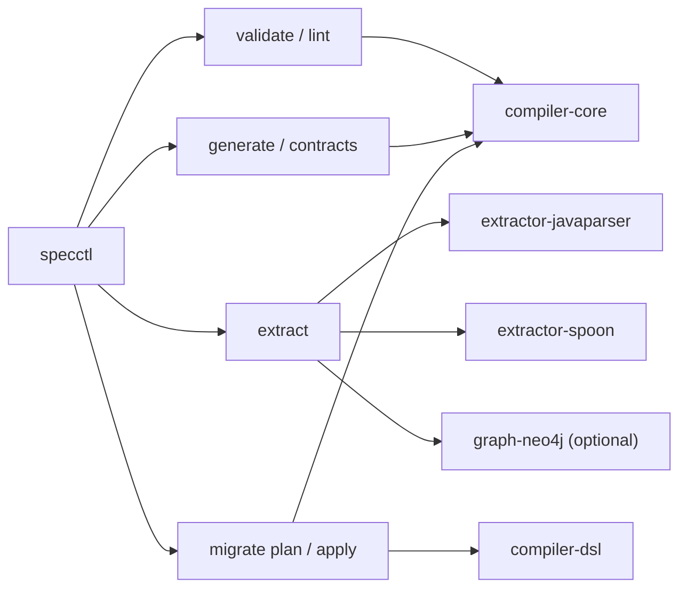

# specctl

`specctl` is the CLI entry point for Kanon. It exposes validation, generation, extraction, migration, and graph-ingest workflows from the command line.

## Responsibility

- Provide an operator-facing shell around `compiler-core`, the extractor backends, and the Neo4j projection adapter.
- Resolve file-based inputs into compile, generate, extract, and migrate operations.
- Keep CLI transport concerns out of the core compiler modules.

## Command Routing



## Available Commands

| Command | Purpose |
| --- | --- |
| `validate` | Compile and print canonical IR JSON. |
| `lint` | Compile and print diagnostics JSON. |
| `generate` | Generate deterministic outputs into a target root. |
| `contracts` | Run the contract-generation path from the CLI. |
| `extract` | Extract facts from a Java source tree with both extractors and optionally project into Neo4j. |
| `migrate plan` | Show deterministic migration actions without applying them. |
| `migrate apply` | Apply migrations and write the updated spec file. |

## Usage Examples

```powershell
.\gradlew.bat :tools:specctl:run --args="validate --specs D:/path/to/specs/service.yaml"
.\gradlew.bat :tools:specctl:run --args="generate --specs D:/path/to/specs/service.yaml --target D:/path/to/output"
.\gradlew.bat :tools:specctl:run --args="extract --project D:/path/to/src/main/java --out D:/path/to/extraction.json"
```

## Notes

- `--specs` accepts either a file path or a directory; directories resolve to `service.yaml`.
- The CLI is thin by design. Business logic should remain in the tool modules, not drift into command handlers.
- Optional Neo4j ingestion during `extract` requires `--neo4j`, `--specs`, and `--generator-run-id`.

## Verification

- `.\gradlew.bat :tools:specctl:compileJava`

## Related Docs

- [Root README](../../README.md)
- [compiler-core](../compiler-core/README.md)
- [graph-neo4j](../graph-neo4j/README.md)
